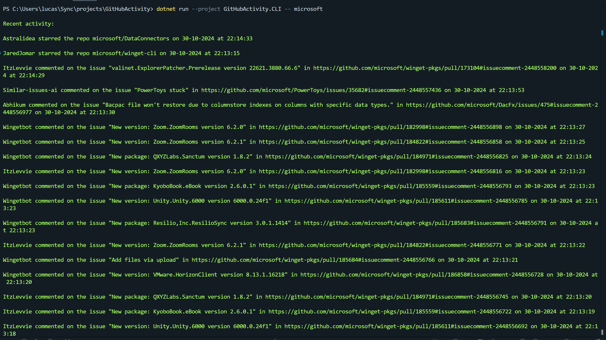

<h1 align="center">GitHubActivity</h1>

<p align="center">
  

  

  
</p>

<div align="center" id="top">
  

&#xa0;

</div>

<!-- Status -->

<!-- <h4 align="center">
	🚧  GitHubActivity 🚀 Under construction...  🚧
</h4>

<hr> -->

<p align="center">
  <a href="#dart-about">About</a> &#xa0; | &#xa0;
  <a href="#sparkles-features">Features</a> &#xa0; | &#xa0;
  <a href="#rocket-technologies">Technologies</a> &#xa0; | &#xa0;
  <a href="#white_check_mark-requirements">Requirements</a> &#xa0; | &#xa0;
  <a href="#checkered_flag-starting">Starting</a> &#xa0; | &#xa0;
  <a href="#memo-license">License</a> &#xa0; | &#xa0;
  <a href="https://github.com/lucaas27" target="_blank">Author</a>
</p>

<br>

## :dart: About

GitHubActivity is a project that retrieves and displays the recent activity of a specified GitHub user. It provides insights into the user's events, such as commits, issues, and pull requests.

It is a challenge from roadmap.sh.

Project Task URL : https://roadmap.sh/projects/github-user-activity

## :sparkles: Features

:heavy_check_mark: Retrieve recent activity of a GitHub user;\
:heavy_check_mark: Display events such as commits, issues, and pull requests;\
:heavy_check_mark: Categorize events by type.

## :rocket: Technologies

The following tools were used in this project:

- [.NET](https://dotnet.microsoft.com/)
- [C#](https://docs.microsoft.com/en-us/dotnet/csharp/)

## :white_check_mark: Requirements

Before starting :checkered_flag:, you need to have [Git](https://git-scm.com) and [.NET 8 SDK](https://dotnet.microsoft.com/download) installed.

## :checkered_flag: Starting

```bash
# Clone this project
$ git clone https://github.com/lucaas27/githubactivity

# Access
$ cd githubactivity

# Install dependencies
$ dotnet restore

# Run the project
$ dotnet run --project GitHubActivity.CLI -- lucaas27

# The application will start and fetch activities for user lucaas27
```

## :memo: License

This project is under license from MIT. For more details, see the [LICENSE](LICENSE.md) file.

Made with :heart: by <a href="https://github.com/lucaas27" target="_blank">Lucas Gomes</a>

&#xa0;

<a href="#top">Back to top</a>
